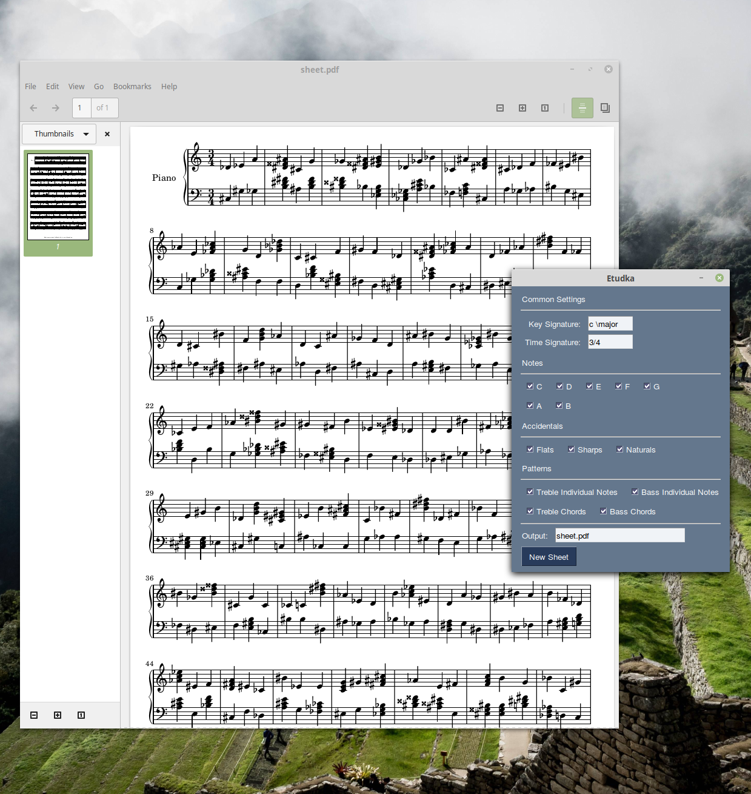

# Etudka



To practise sight reading, sometimes I need to develop certain skills specifically. This usually ends up crawling the web for "2/4 C major with no accidentals and some chords for the left hand" or "3/4 D minor with some accidentals but no chords". To not waste my time, I created Etudka. The difference between human-composed etudes is that you can tell the program what characteristics to use, such as a key, time signature, individual notes and so on.

The downside is that it can only generate simple patterns. In future, I am planning to enrich it with repetitions, proper fingering, ledger lines, rests, and more.

## Installation

```
$ git clone https://github.com/Hirrolot/etudka.git
$ cd etudka
$ pip install -r requirements.txt
$ ./main.py
```

## Settings

### Common Settings

#### `Key Signature`

The key signature in which to generate an etude. Conforms to [LilyPond's key signatures].

[LilyPond's key signatures]: http://lilypond.org/doc/latest/Documentation/learning/accidentals-and-key-signatures#key-signatures

#### `Time Signature`

They time signature in which to generate an etude. Conforms to [LilyPond's time signatures].

[LilyPond's time signatures]: https://lilypond.org/doc/v2.23/Documentation/notation/displaying-rhythms#time-signature

### Notes

Just a list of notes that can be generated. At least one note should be turned on (but it makes sense to enable two or more).

### Accidentals

Enable/disable flats, sharps, and natural accidentals.

### Patterns

 - `Treble`/`Bass Individual Notes` -- generate individual notes on the treble/bass staff.
 - `Treble`/`Bass Chords` -- generate chords on the treble/bass staff.
